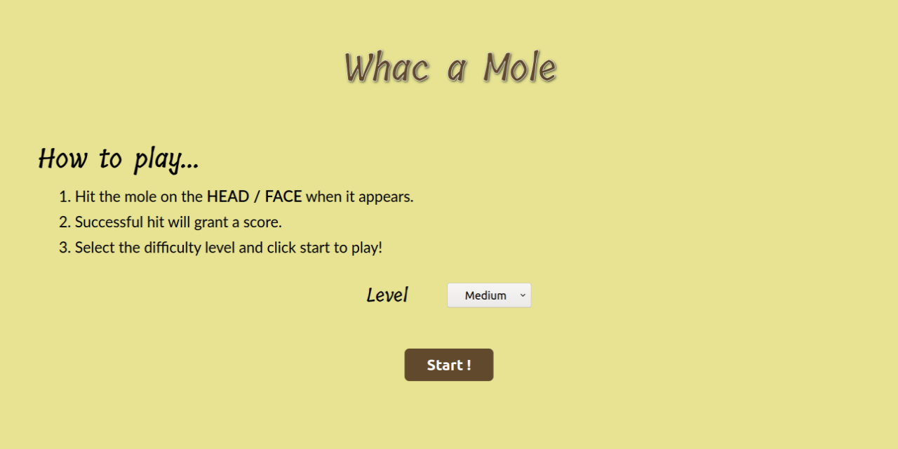
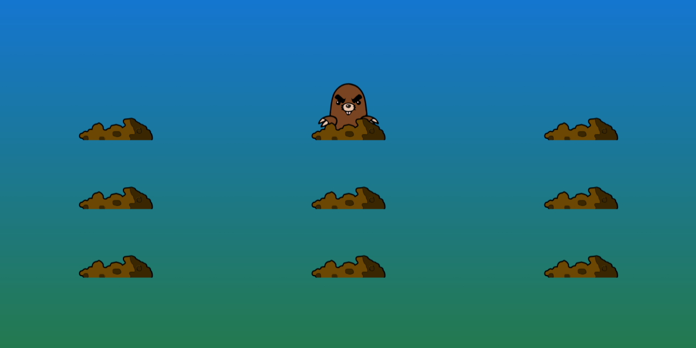

# Whac A Mole

## Introduction

This is a simple one page [Whac a Mole](https://en.wikipedia.org/wiki/Whac-A-Mole) game build using html, css and javascript.

The game is available at [https://harshganda.github.io/WhackAMole](https://harshganda.github.io/WhackAMole/)

## Working

The page is basically divided into 3 divs (which contain multiple divs) - 

1. Menu - A simple div made up of html and css where you can see the heading, rules, levels and start button.
2. Timer - A timer of 3 sec is shown before the start of the game which is implemented using animations. It works simply by changing the opacity and adding animation-delay.
3. Game - Multiple holes are displayed based on difficulty level selected and moles peep out randomly from those holes for a random time period. This is controlled by JavaScript.

## How to Play

1. Select the difficulty level and click start!
   - The difficulty levels are:
      - easy - 3 holes
      - medium - 6 holes
      - hard - 9 holes
      - extreme - 15 holes
   - The time limit is 20 secs.
2. Hit the mole when it appears with the hammer by clicking on it's face.
3. A successful hit will make the mole angry (the image will change).

**Note:** Since an image is being used for the cursor, it may cause some issues on click (hitting the mole). This also increases the difficulty a little bit ;p

Good Luck! 

